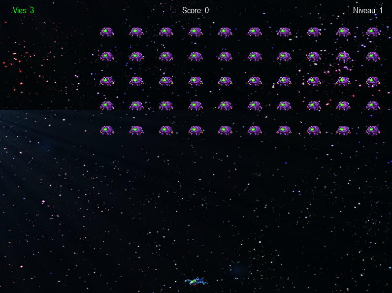

# Python Space Invaders Clone

[English](#english) | [Français](#français)

<br>

## English

A clone of the classic arcade game **Space Invaders**, developed in Python with the Pygame library. This project recreates the retro gaming experience while adding modern features like a scrolling starfield background and sound effects.



### Features

*   **Player Ship**: Move your ship left and right to shoot at the invaders.
*   **Alien Waves**: Hordes of aliens descend and move sideways, speeding up with each level.
*   **Level System**: Difficulty increases after clearing each wave (aliens' speed and firing rate).
*   **Score and Lives**: Keep track of your score and remaining lives.
*   **Scrolling Background**: A vertically scrolling starfield gives an impression of movement through space.
*   **Sound and Music**: Sound effects for shooting and explosions, and background music for atmosphere.
*   **Game Screens**: A start screen and a "Game Over" screen showing the final score.

### Prerequisites

To run the game from the source code, you will need:
*   [Python 3.8](https://www.python.org/downloads/) or newer
*   Pygame library

### Installation & How to Run

Follow these steps to get the project running on your local machine.

1.  **Clone the repository**
    ```sh
    git clone https://github.com/Yanosh77/space_invader_clone.git
    cd your-repo-name
    ```

2.  **(Recommended) Create a virtual environment**
    ```sh
    # Create the environment
    python -m venv venv

    # Activate it
    # On Windows
    .\venv\Scripts\activate
    # On macOS/Linux
    source venv/bin/activate
    ```

3.  **Install dependencies**
    The game only requires Pygame.
    ```sh
    pip install pygame
    ```

4.  **Run the game**
    Execute the main script to start the game.
    ```sh
    python space_invader.py
    ```
  

### How to Play

*   **Movement**: Use the **Left/Right Arrow keys** or **A** and **D** keys to move your ship.
*   **Shoot**: Press the **Spacebar** to fire.
*   **Objective**: Destroy all aliens in each wave before they reach the bottom of the screen or your ship.
*   **Game Over**: On the game over screen, press **R** to restart or **Q** to quit.

---
<br>

## Français

Un clone du jeu d'arcade classique **Space Invaders**, développé en Python avec la bibliothèque Pygame. Ce projet recrée l'expérience de jeu rétro tout en ajoutant des fonctionnalités modernes comme un fond étoilé défilant et des effets sonores.


### Fonctionnalités

*   **Vaisseau Joueur** : Déplacez votre vaisseau de gauche à droite pour tirer sur les envahisseurs.
*   **Vagues d'Aliens** : Des hordes d'aliens descendent et se déplacent latéralement, accélérant à chaque niveau.
*   **Système de Niveaux** : La difficulté augmente après chaque vague éliminée (vitesse et fréquence de tir des aliens).
*   **Score et Vies** : Suivez votre score et le nombre de vies restantes.
*   **Fond Défilant** : Un arrière-plan étoilé qui défile verticalement pour donner une impression de mouvement dans l'espace.
*   **Sons et Musique** : Effets sonores pour les tirs et les explosions, et une musique de fond pour l'ambiance.
*   **Écrans de Jeu** : Un écran de démarrage et un écran "Game Over" affichant le score final.

### Prérequis

Pour lancer le jeu depuis le code source, vous aurez besoin de :
*   [Python 3.8](https://www.python.org/downloads/) ou une version plus récente
*   La bibliothèque Pygame

### Installation et Lancement

Suivez ces étapes pour faire fonctionner le projet sur votre machine.

1.  **Clonez le dépôt**
    ```sh
    git clone https://github.com/Yanosh77/space_invader_clone.git
    cd nom-du-repo
    ```

2.  **(Recommandé) Créez un environnement virtuel**
    ```sh
    # Créez l'environnement
    python -m venv venv

    # Activez-le
    # Sur Windows
    .\venv\Scripts\activate
    # Sur macOS/Linux
    source venv/bin/activate
    ```

3.  **Installez les dépendances**
    Le jeu ne nécessite que Pygame.
    ```sh
    pip install pygame
    ```

4.  **Lancez le jeu**
    Exécutez le script principal pour démarrer le jeu.
    ```sh
    python space_invader.py
    ```
  

### Comment Jouer

*   **Mouvement** : Utilisez les **flèches directionnelles Gauche/Droite** ou les touches **A** et **D** pour déplacer votre vaisseau.
*   **Tirer** : Appuyez sur la **barre d'Espace** pour tirer.
*   **Objectif** : Détruisez tous les aliens de chaque vague avant qu'ils n'atteignent le bas de l'écran ou votre vaisseau.
*   **Game Over** : Sur l'écran de fin, appuyez sur **R** pour rejouer ou sur **Q** pour quitter.
